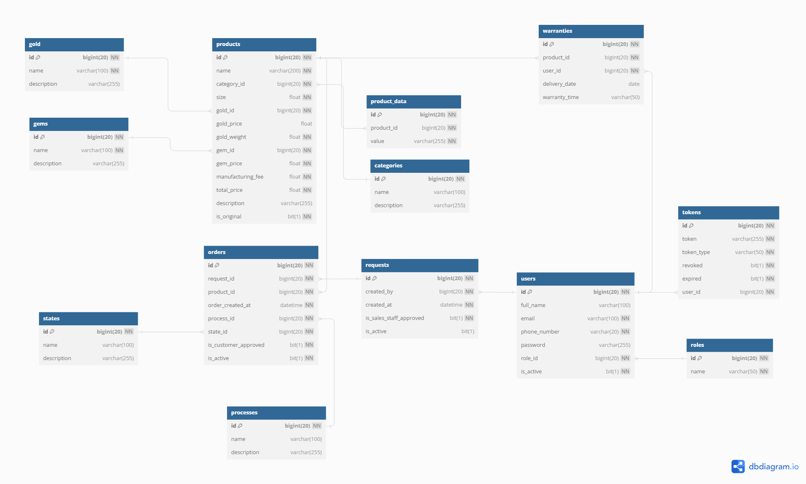

<h1 align="center">Mini-Capstone Project - FPT University 
    Website Application Jewelry Production Order System
    L U X U R I A
</h1>

# [**Table Of Content**](#table-of-content)

- [**Table Of Content**](#table-of-content)
- [**Introduction**](#introduction)
	- [**1. Background**](#1-background)
	- [**2. Project Team**](#2-project-team)
		- [**1. Supervisor**](#1-supervisor)
		-  [**2. Team Member**](#2-team-member)
	- [**3. Technologies**](#3-technologies)
- [**Topic**](#topic)
- [**Database**](#database)
- [**Features**](#features)
  - [**1. Login**](#1-login)
  - [**2. Sign Up**](#2-sign-up)
  - [**3. Forget Password**](#3-forget-password)
  - [**4. Edit Profile**](#4-edit-profile)
  - [**5. Send Request**](#5-send-request)
  - [**6. View Request**](#6-view-request)
  - [**7. Create Order**](#7-create-order)
  - [**8. View Order**](#8-view-order)
- [**Timeline**](#timeline)
  - [**WEEK 1: 06-05-2024 to 12-05-2024**](#week-1-06-05-2024-to-12-05-2024)
  - [**WEEK 2: 13-05-2024 to 19-05-2024**](#week-2-13-05-2024-to-19-05-2024)
  - [**WEEK 3: 20-05-2024 to 26-05-2024**](#week-3-20-05-2024-to-26-05-2024)
  - [**WEEK 4: 27-05-2024 to 02-06-2024**](#week-4-27-05-2024-to-02-06-2024)
  - [**WEEK 5: 03-06-2024 to 09-06-2024**](#week-5-03-06-2024-to-09-06-2024)
  - [**WEEK 6: 10-06-2024 to 16-06-2024**](#week-6-10-06-2024-to-16-06-2024)
  - [**WEEK 7: 17-06-2024 to 23-06-2024**](#week-7-17-06-2024-to-23-06-2024)

# [**Introduction**](#introduction)
## [**1. Background**](#1-background)

    

## [**2. Project Team**](#2-project-member)
### [**1. Supervisor**](#1-supervisor)

    

### [**2. Team Member**](#2-team-member)

    

## [**3. Technologies**](#3-technologies)

    

# [**Topic**](#topic)

    

# [**Database**](#database)

    

<h3 align="center">

**_Database diagram_**

</h3>

**TABLE tokens** - Describe tokens in the system.

**TABLE users** - Contain all users information, including staff and customer.

**TABLE roles** - Contain all role information.

**TABLE requests** - Describe requests in the system.

**TABLE orders** - Describe orders in the system.

**TABLE processes** - Describe processes in the system.

**TABLE states** - Describe states in the system.

**TABLE product_data** - Describe products's data in the system.

**TABLE categories** - Describe categories in the system.

**TABLE gold** - Describe gold in the system.

**TABLE gems** - Describe gems in the system.

**TABLE warranties** - Describe warranties in the system.

# [**Features**](#features)

## [**1. Login**](#1-login)

## [**2. Sign Up**](#2-sign-up)

## [**3. Forget Password**](#3-forget-password)

## [**4. Edit Profile**](#4-edit-profile)

##  [**5. Send Request**](#5-send-request)

##  [**6. View Request**](#6-view-request)
> Customer screen :

> Sales Staff screen :

##  [**7. Create Order**](#7-create-order)

##  [**8. View Order**](#8-view-order)
> Customer screen :

> Sales Staff screen :

# [**Timeline**](#timeline)

## [**WEEK 1: 06-05-2024 to 12-05-2024**](<(#week-1)>)

> Meaning : Ideas Analysis, Figma Prototype, DB Analysis

- **08-05-2024**

Init Project, Requirements Analysis

- **10-05-2024**

Figma : Done 'Home Page' and 'Product Page'

- **11-05-2024**

Figma : Done 'Blogs' and 'Customer View'

- **12-05-2024**

1. Figma : Done all Staff and Manager View
2. Done Requirements Analysis

## [**WEEK 2: 13-05-2024 to 19-05-2024**](<(#week-2)>)

> Meaning : Complete Figma , DB and begin FE

- **13-05-2024**

Complete [**Figma**](https://www.figma.com/design/q3VUJxfD7ptRIA2SjUIzgR/Luxuria?node-id=0%3A1&t=mTxfp7FHW1BBdV3U-1)

- **14-05-2024**

Complete ERD DB_V1

## [**WEEK 3: 20-05-2024 to 26-05-2024**](<(#week-3)>)

## [**WEEK 4: 27-05-2024 to 02-06-2024**](<(#week-4)>)

## [**WEEK 5: 03-06-2024 to 09-06-2024**](<(#week-5)>)

## [**WEEK 6: 10-06-2024 to 16-06-2024**](<(#week-6)>)

## [**WEEK 7 - SUMMER: 17-06-2024 to 23-06-2024**](<(#week-7)>)